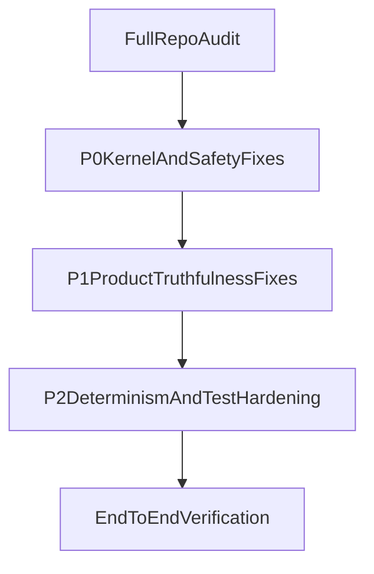

# Sokol Full Audit + Product Hardening Plan

## Scope And Constraints

- Preserve runtime architecture: deterministic execution kernel, single mutation gate, strict `Result` flow, observer-only UI, contract-bound tools, deterministic memory, passive trace.
- Stage ordering fixed by your directive:
  - **Stage 1:** complete full-repo Python audit report.
  - **Stage 2:** implement only **P0/P1/P2** fixes from Stage 1.
- No style refactors, no architecture invention, no unrelated features.

## Current High-Risk Findings To Anchor Work

- Runtime contract drift (mixed `Result` usage, `unwrap()`/`error()` API mismatches) across [sokol/runtime/result.py](sokol/runtime/result.py), [sokol/runtime/orchestrator.py](sokol/runtime/orchestrator.py), [sokol/runtime/router.py](sokol/runtime/router.py), [sokol/runtime/state.py](sokol/runtime/state.py), [sokol/runtime/intent.py](sokol/runtime/intent.py).
- Emergency path is not reliably executable as a hard interrupt in [sokol/runtime/live_loop.py](sokol/runtime/live_loop.py) and [sokol/runtime/orchestrator.py](sokol/runtime/orchestrator.py).
- Tool/action runtime truthfulness gaps in [sokol/tools/base.py](sokol/tools/base.py), [sokol/tools/builtin/automation.py](sokol/tools/builtin/automation.py), [sokol/action/executor.py](sokol/action/executor.py), placeholder tools.
- UI/perception truthfulness and wiring mismatches in [sokol/main.py](sokol/main.py), [sokol/perception/wake_word.py](sokol/perception/wake_word.py), [sokol/perception/screen_input.py](sokol/perception/screen_input.py).
- Memory/contract/test drift in [sokol/runtime/memory_layer.py](sokol/runtime/memory_layer.py), [sokol/runtime/contract_validator.py](sokol/runtime/contract_validator.py), [tests](tests).

## Stage 1 — Full Repository Audit Deliverable

### 1) Enumerate complete Python surface

- Build full `.py` inventory by subsystem:
  - `core`, `runtime`, `tools`, `action`, `memory`, `ui`, `perception`, `safety`, `planning`, `observability`, `integrations`, `tests`, package init and startup paths.
- Identify startup-reachable paths from [sokol/main.py](sokol/main.py).

### 2) File-by-file classification (mandatory)

For each Python file:
- Purpose.
- Real functionality status: implemented/partial/placeholder/misleading/broken/dead/unsafe/production-usable.
- Contract/determinism/safety status.
- Fit to original Sokol intent.

### 3) Public-function verification

For each public function:
- Claimed behavior vs actual behavior.
- Return contract truth (`Result`, `None`, raw mismatches).
- Side effects and state mutation legality.
- Reachability (wired/dead).
- Keep/fix/remove recommendation.

### 4) Critical-pattern sweep

Explicitly detect and map all occurrences of:
- `None` returns where contract-bound behavior is required.
- Mixed `Result` and raw returns.
- Fake success / placeholder success.
- Hidden callback control-flow side effects.
- Direct state mutation outside gate.
- Duplicate response/output paths.
- Mutable response aliasing.
- Non-deterministic memory selection.
- Emergency bypass or no-op emergency flows.
- Tool schema mismatch and declared-vs-actual behavior drift.

### 5) Stage 1 report output structure

Produce exactly requested format:
- `PART 1 — IMPLEMENTATION SUMMARY` (set to “not started in Stage 1”).
- `PART 2 — FULL REPOSITORY AUDIT` (by subsystem, by file, by function).
- `PART 3 — CRITICAL VIOLATIONS` (P0/P1/P2).
- `PART 4 — FIX PLAN` (ordered and dependency-aware).
- `PART 5 — FINAL VERDICT`.

## Stage 2 — Implementation (P0/P1/P2 only)

### Batch A (P0 Stabilization)

- Normalize `Result` API usage and remove invalid method assumptions across runtime kernel files.
- Restore emergency hard-interrupt path correctness and eliminate recursion/no-op branches.
- Fix startup/runtime crashers tied to strict `Result` invariants and undefined symbols.
- Ensure one input -> one execution path -> one output sink.

### Batch B (P1 Product Truthfulness And Safety)

- Harden tool/action contracts and side-effect truthfulness (timeout semantics, risk classification, undo truthfulness).
- Make UI/perception wiring truthful: no claimed feature without real path; explicit unavailability where missing.
- Remove or isolate callback/control paths that violate observer-only/UI constraints.

### Batch C (P2 Determinism And Auditability Hardening)

- Deterministic memory retrieval/storage edge-case fixes and mutation-leak prevention.
- Observability/trace consistency improvements without introducing control side effects.
- Align tests to real runtime behavior and contract semantics.

## Dependency Graph

## Verification Strategy After Each Batch

- Static verification: lint and compile over changed modules.
- Contract verification: `Result` shape consistency and explicit error propagation.
- Runtime verification: emergency path execution, response channel singularity, no hidden state mutation.
- Product truth verification: voice/wake/screen/tool/UI features either work end-to-end or fail explicitly and visibly.
- Audit verification: every changed file reclassified with updated readiness.

## Risks And Controls

- **Risk:** touching kernel and safety paths can surface masked faults.  
  **Control:** P0-first sequencing and narrow patch sets.
- **Risk:** placeholder product modules currently report success.  
  **Control:** convert to explicit failure semantics where real implementation absent.
- **Risk:** test suite drift vs runtime contracts.  
  **Control:** update tests only where behavior is now corrected and contract-true.
